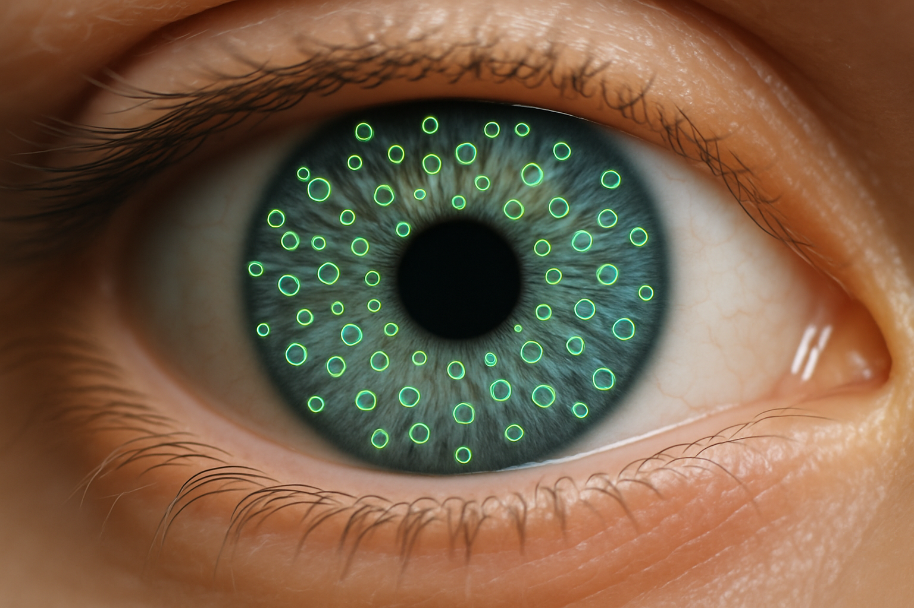
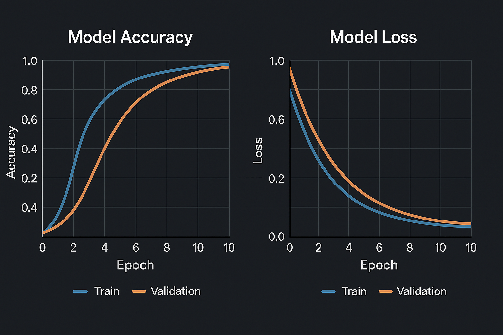

[](https://www.python.org/)
[](https://www.tensorflow.org/)
[](https://opensource.org/licenses/MIT)

This project implements a sophisticated, hybrid approach to iris recognition by combining classic computer vision features with modern deep learning techniques. It leverages **SIFT** for keypoint detection and **ResNet50** for deep feature extraction, creating a robust feature set for a final classification model.

---

## 📋 Table of Contents
- [Core Concept](#-core-concept)
- [Project Workflow](#-project-workflow)
- [Results](#-results)
- [Key Features](#-key-features)
- [Installation Guide](#-installation-guide)
- [How to Use](#-how-to-use)
- [Prediction on a New Image](#-prediction-on-a-new-image)
- [Project Structure](#-project-structure)
- [Contact](#-contact)

---

## 🧠 Core Concept

The strength of this project lies in its **hybrid feature engineering**. The pipeline first uses a classic computer vision algorithm to find points of interest, then uses a deep learning model to describe them.

**1. SIFT (Scale-Invariant Feature Transform):**
First, we use SIFT to detect stable, localized keypoints in the iris texture. This step identifies the most information-rich parts of the image, as visualized below. This technique is robust to changes in scale and rotation.



**2. ResNet50 Deep Feature Extraction:**
Next, we extract small image patches around each SIFT keypoint. These patches are then fed into a pre-trained ResNet50 model, which converts each patch into a powerful, high-dimensional deep feature vector.

By combining SIFT's precise localization with ResNet50's rich descriptive power, we create a final feature set that is both robust and highly discriminative.

---

## 🔄 Project Workflow

The project is structured as a clear, step-by-step pipeline, making it easy to understand and reproduce.

`Raw Data` -> `1_prepare_data.py` -> `Train/Test Split` -> `2_extract_features.py` -> `features.csv` -> `3_train_classifier.py` -> `Trained Model`

---

## 📊 Results

The final classification model was trained on the hybrid features extracted from the dataset. The training history below shows successful learning and convergence. The accuracy plot demonstrates a steady increase for both training and validation sets, while the loss plot shows a consistent decrease, indicating that the model is learning effectively without significant overfitting.



---

## ✨ Key Features

-   **Hybrid Feature Model:** Unites the strengths of SIFT and ResNet50 for superior feature representation.
-   **End-to-End Pipeline:** Provides a complete, runnable workflow from data preparation to model training and prediction.
-   **Modular & Scalable Code:** The project is broken down into logical scripts (`prepare`, `extract`, `train`), making it easy to maintain and extend.
-   **Efficient Data Handling:** Saves extracted features to a CSV, allowing for rapid experimentation with different classifiers without re-running the heavy feature extraction process.
-   **Inference Script:** Includes a `predict.py` script to demonstrate how to use the trained model on new, unseen images.

---

## ⚙️ Installation Guide

**1. Clone the repository:**
```bash
git clone https://github.com/your-username/HybridVisionClassifier.git
cd HybridVisionClassifier
```

**2. Create a virtual environment:**
```bash
python -m venv venv
source venv/bin/activate  # On Windows: venv\Scripts\activate
```

**3. Install dependencies:**
```bash
pip install -r requirements.txt
```

---

## 🚀 How to Use

Follow these steps in order to run the full pipeline.

**Step 0: Place Your Data**
-   Unzip and place your `zoomed_in_eyes` dataset folder inside the `data/raw/` directory.

**Step 1: Prepare the Dataset**
-   Run the first script to split your raw data into training and testing sets.
```bash
cd src
python 1_prepare_data.py
```
-   This will create `train` and `test` folders inside `data/processed/`.

**Step 2: Extract Hybrid Features**
-   This is the most time-consuming step. It will iterate through all training images, extract SIFT+ResNet50 features, and save them to a CSV file.
```bash
python 2_extract_features.py
```
-   A file named `features_and_labels.csv` will be created in the `data/` folder.

**Step 3: Train the Classifier**
-   This script loads the features from the CSV and trains the final classification model.
```bash
python 3_train_classifier.py
```
-   The trained model (`iris_hybrid_classifier.h5`) and a label encoder will be saved in a new `models/` directory.

---

## 🔎 Prediction on a New Image

To test the trained model on a single, new image, use the `predict.py` script.

```bash
python predict.py /path/to/your/new_image.jpg```
The script will output the predicted class for the image.

---

## 📂 Project Structure
```
HybridVisionClassifier/
├── docs/
│   └── images/
├── .gitignore
├── README.md
├── requirements.txt
├── data/
│   ├── raw/
│   │   └── .gitkeep
│   └── processed/
│       └── .gitkeep
└── src/
    ├── __init__.py
    ├── config.py
    ├── 1_prepare_data.py
    ├── 2_extract_features.py
    ├── 3_train_classifier.py
    └── predict.py
 ```
```
## 📜 License

This project is licensed under the MIT License. See the [LICENSE](LICENSE) file for more details.


## 📞 Contact

Feel free to reach out with any questions or for collaboration opportunities.

**Yahiaoui Raiane**
-   **Email:** `ikba.king2015@gmail.com`
-   **LinkedIn:** [linkedin.com/in/yahiaoui-raiane-253911262](https://www.linkedin.com/in/yahiaoui-raiane-253911262/)
